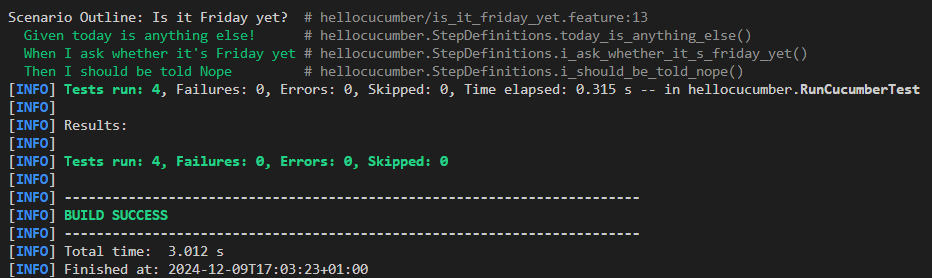
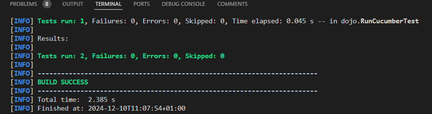

= R5.A.08 -- Dépôt pour les TPs
:icons: font
:MoSCoW: https://fr.wikipedia.org/wiki/M%C3%A9thode_MoSCoW[MoSCoW]

Ce dépôt concerne les rendus de mailto:hugo.berdinel@etu.univ-tlse2.fr[Hugo Berdinel].

== TP1

.Contenu du fichier is_it_friday_yet.feature
[source,cucumber]
---
Feature: Is it Friday yet ?
Scenario Outline: Is it Friday yet?
  Given today is <day>
  When I ask whether it's Friday yet
  Then I should be told <answer>
  Examples:
    | day            | answer |
    | Friday         | TGIF   |
    | Sunday         | Nope   |
    | anything else! | Nope   |
---

.Test passés

== TP2

.Classe Order.java
[source,java]
---
private static class Order {

        private List<String> cocktails;
        private String owner, target;

        public Order() {
            this.cocktails = List.of();
        }

        public void declareOwner(String owner) {
            this.owner = owner;
        }

        public void declareTarget(String target) {
            this.target = target;
        }

        public List<String> getCocktails(int nb) {
            return this.cocktails.subList(0, nb);
        }
    }
---

! La classe est static car déclarée dans la classe CocktailSteps.java

.Test passés
