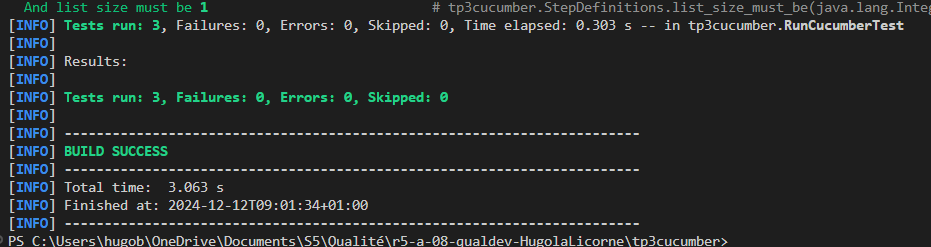

= R5.A.08 -- Dépôt pour les TPs
:icons: font
:MoSCoW: https://fr.wikipedia.org/wiki/M%C3%A9thode_MoSCoW[MoSCoW]

Ce dépôt concerne les rendus de mailto:hugo.berdinel@etu.univ-tlse2.fr[Hugo Berdinel].

== TP1

.Contenu du fichier is_it_friday_yet.feature
[source,cucumber]
---
Feature: Is it Friday yet ?
Scenario Outline: Is it Friday yet?
  Given today is <day>
  When I ask whether it's Friday yet
  Then I should be told <answer>
  Examples:
    | day            | answer |
    | Friday         | TGIF   |
    | Sunday         | Nope   |
    | anything else! | Nope   |
---

.Test passés
image::test_tp1.png[width=80%]

== TP2

.Classe Order.java
[source,java]
---
private static class Order {

        private List<String> cocktails;
        private String owner, target;

        public Order() {
            this.cocktails = List.of();
        }

        public void declareOwner(String owner) {
            this.owner = owner;
        }

        public void declareTarget(String target) {
            this.target = target;
        }

        public List<String> getCocktails(int nb) {
            return this.cocktails.subList(0, nb);
        }
    }
---

! La classe est static car déclarée dans la classe CocktailSteps.java

.Test passés
image::test_tp2.png[width=80%]

== TP3

.Fichier cucumber tp3.feature
[source,cucumber]
---
Feature: Managing players in a list based on a random draw
  I want to add or remove players from the list

  Scenario: Add a player to the list when the draw is positive
    Given an initially empty list of players
    And a player named "Etienne" is ready to be added
    When the random draw is positive
    Then Etienne must be added to the list
    And list size must be 1

  Scenario: Remove a player from the list when the random draw is negative
    Given a list containing the player "Bastien"
    When the random draw is negative
    Then the player "Bastien" must be removed from the list
    And list size must be 0

  Scenario: Do nothing when the draw is neutral
    Given a list containing the player "Eliot"
    When the random draw is neutral
    Then the list must contain only the player "Eliot"
    And list size must be 1
---

.Classe StepDefinitions.java

---
package tp3cucumber;

import java.util.List;

import static org.junit.jupiter.api.Assertions.assertEquals;
import static org.junit.jupiter.api.Assertions.assertFalse;
import static org.junit.jupiter.api.Assertions.assertTrue;

import io.cucumber.java.en.Given;
import io.cucumber.java.en.Then;
import io.cucumber.java.en.When;

public class StepDefinitions {

    private Tp3CucumberTests tp3CucumberTests;
    private String joueur;

    public StepDefinitions() {
        tp3CucumberTests = new Tp3CucumberTests();
    }

    @Given("an initially empty list of players")
    public void an_initially_empty_list_of_players() {
        tp3CucumberTests.reinitialiserListe();
        assertTrue(tp3CucumberTests.getJoueurs().isEmpty());
    }

    @Given("a player named {string} is ready to be added")
    public void a_player_named_is_ready_to_be_added(String name) {
        joueur = name;
    }

    @Given("a list containing the player {string}")
    public void a_list_containing_the_player(String name) {
        tp3CucumberTests.reinitialiserListe();
        tp3CucumberTests.ajouterJoueur(name);
        joueur = name;
        assertTrue(tp3CucumberTests.getJoueurs().contains(name));
    }

    @When("the random draw is positive")
    public void the_random_draw_is_positive() {
        tp3CucumberTests.setTirageSimule(1);
        tp3CucumberTests.tirageAleatoire(joueur);
    }

    @When("the random draw is negative")
    public void the_random_draw_is_negative() {
        tp3CucumberTests.setTirageSimule(-1);
        tp3CucumberTests.tirageAleatoire(joueur);
    }

    @When("the random draw is neutral")
    public void the_random_draw_is_neutral() {
        tp3CucumberTests.setTirageSimule(0);
        tp3CucumberTests.tirageAleatoire(joueur);
    }

    @Then("Etienne must be added to the list")
    public void etienne_must_be_added_to_the_list() {
        assertTrue(tp3CucumberTests.getJoueurs().contains("Etienne"));
    }

    @Then("the player {string} must be removed from the list")
    public void the_player_must_be_removed_from_the_list(String name) {
        assertFalse(tp3CucumberTests.getJoueurs().contains(name));
    }

    @Then("the list must contain only the player {string}")
    public void the_list_must_contain_only_the_player(String name) {
        List<String> joueurs = tp3CucumberTests.getJoueurs();
        assertEquals(1, joueurs.size());
        assertTrue(joueurs.contains(name));
    }

    @Then("list size must be {int}")
    public void list_size_must_be(Integer expectedSize) {
        assertEquals(expectedSize, tp3CucumberTests.getTailleListe());
    }
}
---

.Test passés

== TP4

.Documentation cukedoctor TP2

:toc: right
:backend: html5
:doctitle: Living Documentation
:doctype: book
:icons: font
:!numbered:
:sectanchors:
:sectlink:
:docinfo:
:source-highlighter: highlightjs
:toclevels: 3
:hardbreaks:
:chapter-label: Chapter
:version-label: Version

= *Living Documentation*

== *Summary*
[cols="12*^m", options="header,footer"]
|===
3+|Scenarios 7+|Steps 2+|Features: 1

|[green]#*Passed*#
|[red]#*Failed*#
|Total
|[green]#*Passed*#
|[red]#*Failed*#
|[purple]#*Skipped*#
|[maroon]#*Pending*#
|[yellow]#*Undefined*#
|[blue]#*Missing*#
|Total
|Duration
|Status

12+^|*<<Cocktail-Ordering>>*
|1
|0
|1
|3
|0
|0
|0
|0
|0
|3
|009ms
|[green]#*passed*#
12+^|*Totals*
|1|0|1|3|0|0|0|0|0|3 2+|009ms
|===

== *Features*

[[Cocktail-Ordering, Cocktail Ordering]]
=== *Cocktail Ordering*

ifndef::backend-pdf[]
minmax::Cocktail-Ordering[]
endif::[]
****
As Romeo, I want to offer a drink to Juliette so that we can discuss together (and maybe more).
****

==== Scenario: Creating an empty order

==========
Given ::
"Romeo" who wants to buy a drink icon:thumbs-up[role="green",title="Passed"] [small right]#(001ms)#
When ::
an order is declared for "Juliette" icon:thumbs-up[role="green",title="Passed"] [small right]#(000ms)#
Then ::
there is 0 cocktail in the order icon:thumbs-up[role="green",title="Passed"] [small right]#(006ms)#
==========

.Documentation TP3 avec cukedoctor

:toc: right
:backend: html5
:doctitle: Living Documentation
:doctype: book
:icons: font
:!numbered:
:sectanchors:
:sectlink:
:docinfo:
:source-highlighter: highlightjs
:toclevels: 3
:hardbreaks:
:chapter-label: Chapter
:version-label: Version

= *Living Documentation*

== *Summary*
[cols="12*^m", options="header,footer"]
|===
3+|Scenarios 7+|Steps 2+|Features: 1

|[green]#*Passed*#
|[red]#*Failed*#
|Total
|[green]#*Passed*#
|[red]#*Failed*#
|[purple]#*Skipped*#
|[maroon]#*Pending*#
|[yellow]#*Undefined*#
|[blue]#*Missing*#
|Total
|Duration
|Status

12+^|*<<Managing-players-in-a-list-based-on-a-random-draw>>*
|3
|0
|3
|13
|0
|0
|0
|0
|0
|13
|016ms
|[green]#*passed*#
12+^|*Totals*
|3|0|3|13|0|0|0|0|0|13 2+|016ms
|===

== *Features*

[[Managing-players-in-a-list-based-on-a-random-draw, Managing players in a list based on a random draw]]
=== *Managing players in a list based on a random draw*

ifndef::backend-pdf[]
minmax::Managing-players-in-a-list-based-on-a-random-draw[]
endif::[]
****
I want to add or remove players from the list
****

==== Scenario: Add a player to the list when the draw is positive

==========
Given ::
an initially empty list of players icon:thumbs-up[role="green",title="Passed"] [small right]#(005ms)#
And ::
a player named "Etienne" is ready to be added icon:thumbs-up[role="green",title="Passed"] [small right]#(004ms)#
When ::
the random draw is positive icon:thumbs-up[role="green",title="Passed"] [small right]#(000ms)#
Then ::
Etienne must be added to the list icon:thumbs-up[role="green",title="Passed"] [small right]#(000ms)#
And ::
list size must be 1 icon:thumbs-up[role="green",title="Passed"] [small right]#(003ms)#
==========

==== Scenario: Remove a player from the list when the random draw is negative

==========
Given ::
a list containing the player "Bastien" icon:thumbs-up[role="green",title="Passed"] [small right]#(000ms)#
When ::
the random draw is negative icon:thumbs-up[role="green",title="Passed"] [small right]#(000ms)#
Then ::
the player "Bastien" must be removed from the list icon:thumbs-up[role="green",title="Passed"] [small right]#(000ms)#
And ::
list size must be 0 icon:thumbs-up[role="green",title="Passed"] [small right]#(000ms)#
==========

==== Scenario: Do nothing when the draw is neutral

==========
Given ::
a list containing the player "Eliot" icon:thumbs-up[role="green",title="Passed"] [small right]#(000ms)#
When ::
the random draw is neutral icon:thumbs-up[role="green",title="Passed"] [small right]#(000ms)#
Then ::
the list must contain only the player "Eliot" icon:thumbs-up[role="green",title="Passed"] [small right]#(000ms)#
And ::
list size must be 1 icon:thumbs-up[role="green",title="Passed"] [small right]#(000ms)#
==========

